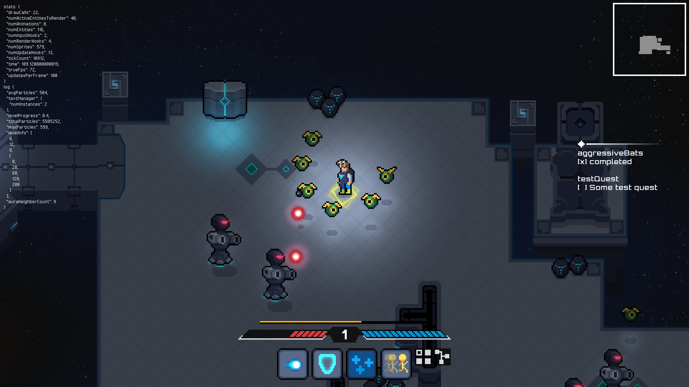

# Name of game TBD

This is an action role playing game set in a sci-fi universe. The core game loop revolves around the idea of destroying enemies, collecting loot and building skills to get stronger.

## Playing the game

*Note: Currently, the game only supports Windows.*

Double-click `./bin/game.exe` in the Windows explorer.

## Architecture

* Programming language - [Haxe](https://haxe.org/)
* Game Engine - [Heaps](https://heaps.io/)

## Systems

* auto-save game in background (src/Session.hx)
  * game state changes are action-based and logged to a file
  * final game state is rebuilt at load-time by processing the log and applying all the actions to the previous state
* collision (src/Collision.hx) - handles collision detection using aabb (axis-aligned bounding box) and spatial-hashes for efficiency.
* ecs, entity component system (src/Entity.hx) - managing game objects and their state in a functional way
* level editor (src/Editor.hx) - for quickly designing levels
* camera (src/Camera.hx)
* lighting (src/LightingSystem.hx)
* skill tree (src/PassiveSkillTree.hx) - a tree of player passive upgrades.
* enemy ai (src/Game.hx, line 394, `class Ai`) - a basic ai system using boids algorithm for local avoidance
* rendering (src/SpriteBatchSystem.hx) - layer-based rendering ordered by the y-axis

## Future enhancements

* more performant and smarter ai system using vector fields for pathing and local avoidance
* refactor global state to not be a singleton - allows us to be more explicit about accessing and manipulating the global state instead of touching a global "var". Also makes it easier to write tests because we can guarantee that each state is a fresh instance.
* refactor global state to use a redux-style approach via a series of mutation functions and action types
* performance profiler - find memory leaks and performance bottlenecks
* manual step-through frames (game only advances to next frame when you press a key)
* extend quest system with a decision tree
* refactor code into smaller files
* more unit tests
* less `var` and more `final` variable declarations - many of the `var` declarations in the application are never mutated. We used `var` alot initially because we didn't realize that the `final` declaration existed.

## Third-party applications

* Pixel Art - [Aseprite](https://www.aseprite.org/)

## Build and compile

### Dev server

This will build all assets (art, maps, sprite sheets) and then compile the game.

`npm start`

### Production build

`npm run productionBuild`

## Game Design

### Music ideas

Electric guitar themed, capcom style

[halo guardians](https://ocremix.org/remix/OCR03453)
[un squadron remix](https://ocremix.org/remix/OCR00277)
[megaman soccer](https://ocremix.org/remix/OCR02922)

### Story & Concepts

#### Player's orb companion

The player can have more than one orb and uses these orbs to power different abilities.

### Passive Tree Ideas

#### Basic nodes
* Increased action speed
* Cooldown reduction
* Flat increased maximum health
* Percent increased maximum health

#### Special nodes
* Strength in Numbers - Increases maximum number of spider bots.
* Swarm - Summon twice the number of bots. Bots decay over time. Decay 10% health/sec.
* Rampage - Increased damage at the expense of health. Each time you hit an enemy you gain a rampage stack. Each rampage stack increases health cost by a percentage of the ability's energy cost and increases damage by X%.
